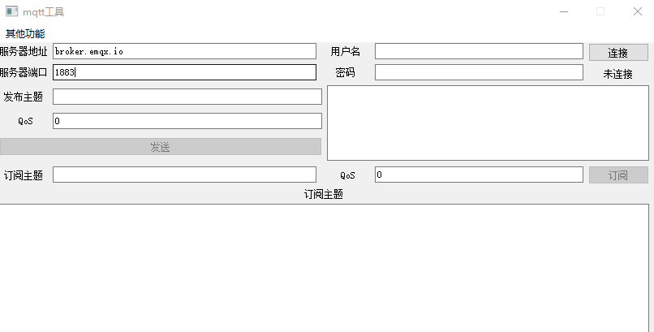

## install
* python3
* paho-mqtt
```
pip install paho-mqtt
```
* pyqt5
```
pip install pyqt5
```

# mqtt tool
## About
MQTT-tool is MQTT client desktop application made using PyQT5 and paho-mqtt.

## dependencies
### paho-mqtt
```
$ sudo pip install paho-mqtt
```
### PyQT5
```
$ sudo pip install PyQt5
```

## Running 
```
python3 main.py
```

## UI
